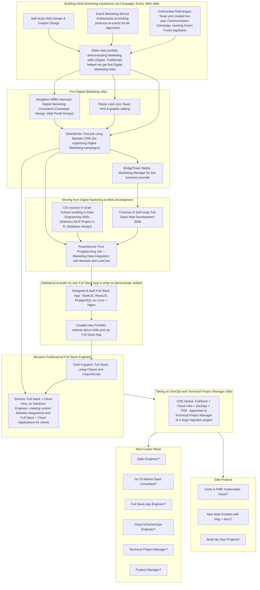

<h1 align="center">Hi, I'm Patrick</h1>
<h3 align="center">A creative web app/cloud engineer focused on the NodeJS, Python, Cloud Infrastructure (IaC), Container Orchestration, & CNCF ecosystems.</h3>

<!-- 

 -->

<!-- 
&nbsp;
 -->

<!-- 
- 🔭 I’m currently working on **side hustle (consultancy projects), interviews (Sales Engineer, Solutions Engineer, Product Manager, Technical Project Manager)** (Feb 2024)

- 🌱 I’m currently learning **NextJS (+ TailwindCSS), Strapi CMS** Backburner: Data Structures & Algorithms, Systems Design, Python OOP**

- 👯 I’m looking to collaborate on **Agri-tech projects**

- 💬 Ask me about **my interest in building a in-person & digital communities** centered around growth, nature, agriculture, and technology
-->

<h3 align="left">Connect with me:</h3>

  <ul>
  <!-- <li><a href="https://docusaurus-blog-j24.vercel.app/" target="blank">My Docusaurus Docs & Blog</a>
      Bear with me-- just started it, have not formatted it yet</li> -->
  <li><a href="https://pmeaney.com/" target="blank">My Portfolio &amp; Background</a>
    <!--   It's hurtin' for an update.  One is coming soon</li> -->
    
  <!-- <li><a href="https://github.com/pmeaney/roadcodeshowed" target="blank">"The Road Code Showed"</a>
     an upcoming educational project about how to become a software developer, from scratch, without a degree</li> -->
  <li>&nbsp;&nbsp;&nbsp;</li></ul>

<!--

<h2 align="left">Featured Tools</h2>

  
  <li><a href="https://gist.github.com/n1snt/454b879b8f0b7995740ae04c5fb5b7df" target="blank">ZShell with Oh-my-zsh and plugins</a> <a href="https://github.com/wting/autojump" target="blank">plus autojump</a>
     This is my favorite macos & linux shell setup-- It includes autosuggesions, auto-complete, and syntax highlighting.  The autosuggesion feature is amazing-- the shell automatically looks up and presents a list of all currently possible commands.  I also install autojump.</li>
  </ul>

-->

<h2 align="left">Some of my Favorite Languages, Frameworks, and Tools:</h2>
<h3 align="left">Infrastructure (Cloud, Database, SystemAdmin, DevOps, etc.)</h3>

&nbsp;&nbsp;&nbsp;&nbsp;&nbsp;&nbsp;&nbsp;&nbsp;<!---->&nbsp;&nbsp;&nbsp;&nbsp;&nbsp;&nbsp;&nbsp;&nbsp;&nbsp;&nbsp;&nbsp;&nbsp;&nbsp;&nbsp;&nbsp;&nbsp;&nbsp;&nbsp;&nbsp;&nbsp;
&nbsp;&nbsp;&nbsp;&nbsp;&nbsp;&nbsp;&nbsp;&nbsp;&nbsp;&nbsp;&nbsp;&nbsp;

<h3 align="left">Server side</h3>

<a href="https://nodejs.org" target="_blank" rel="noreferrer">&nbsp;&nbsp;&nbsp;&nbsp;&nbsp;&nbsp&nbsp;&nbsp;

<h3 align="left">Client side</h3>

&nbsp;&nbsp;&nbsp;&nbsp;&nbsp;&nbsp;&nbsp;&nbsp;&nbsp;&nbsp;&nbsp;&nbsp;&nbsp;&nbsp;&nbsp;&nbsp;&nbsp;&nbsp;&nbsp;&nbsp;

<h3 align="left">Data Science</h3>

          

          

&nbsp;&nbsp;&nbsp;&nbsp;

<h3 align="left">Toolset for Crafting</h3>

&nbsp;&nbsp;&nbsp;&nbsp;&nbsp;&nbsp;&nbsp;&nbsp;

<h3 align="left">Resources for Learning</h3>
&nbsp;&nbsp;&nbsp;&nbsp;&nbsp;&nbsp;

<h3 align="left">Customer Relationship Management Systems</h3>

&nbsp;&nbsp;&nbsp;&nbsp;

<h3 align="left">Content Management Systems</h3>

&nbsp;&nbsp;

<h3 align="left">Productivity Tools & Systems</h3>
&nbsp;&nbsp;&nbsp;&nbsp;&nbsp;&nbsp;

<h3>My Career Progression</h3>

via <a href="https://mermaid.js.org/syntax/flowchart.html" target="_blank">MermaidJS diagram</a>

